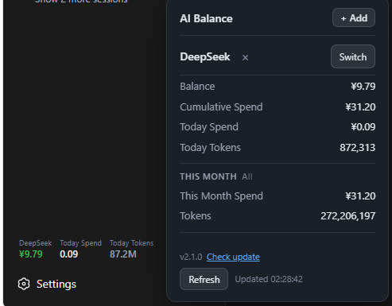

# dsh-deepseek-balance-widget

English | [中文](README.md)

A multi-provider AI balance widget for the dsh web sidebar. **DeepSeek** is built in; add **MiMo (Xiaomi)** from the popover. Auto-refreshes every 30 seconds.

## Features



- Sidebar shows Balance / Today spend / Today tokens, auto-refresh every 30 s; values follow the selected provider
- Popover header shows the current provider: a "**Switch**" menu changes to another added provider, and "**×**" removes it
- "**+ Add**" button (top right): add **MiMo**
- Details: balance, cumulative spend, today spend, today tokens, monthly usage (monthly spend / tokens)
- "**AI 帮我配置**": one click copies a prompt; send it to your AI and it guides you through fetching credentials and writing them locally — no digging through cookies by hand
- Version shown in the popover footer; one-click auto-update when a new version is available

## Install

Requires: dsh installed (with `dsh web` working).

```bash
dsh plugin --profile web add dsh-deepseek-balance-widget@2.3.1
```

Installed from npm and auto-registered by dsh. **Restart `dsh web`** and the balance button appears in the sidebar.

> Always include the version `@2.3.1`. A bare `add` follows npm's `latest` tag, which may be hijacked by older versions and silently install an outdated release.

Or just tell your AI:

> Install the dsh-deepseek-balance-widget plugin for me via npm.

## Configuration

On first use the plugin creates a DeepSeek entry and reads your local `DEEPSEEK_API_KEY`.

To add MiMo, open the popover, click "+ Add", then "AI 帮我配置", and send the copied prompt to your AI. Or just tell your AI:

> Configure dsh-deepseek-balance-widget for me.

The AI takes care of everything: asks for your API key / guides you through getting the platform cookie → writes the local config → reminds you to **restart `dsh web`**.

| Provider | Credential | Notes |
|---|---|---|
| DeepSeek | `DEEPSEEK_API_KEY` | Required, balance |
| DeepSeek usage | `DEEPSEEK_PLATFORM_TOKEN` | Optional, cumulative / monthly / today stats |
| MiMo (Xiaomi) | Login cookie | Guided by your AI |

Credentials are stored locally in `~/.dsh/ai-balances.json`; nothing is shipped with the plugin and nothing is uploaded.

## Update

The latest stable release is **`2.3.1`**. Upgrade to it regardless of which older version you currently have.

### Method 1: One-click from the popover (recommended for installed users)

1. Open the balance popover; the footer shows the version. When a newer one exists it reads `vX → v2.3.1 更新`.
2. Click "**检查更新**" (Check for update). The plugin pulls and installs the highest semver version from npm automatically.
3. After install you **must fully restart `dsh web`** (stop the `dsh web` process / quit the desktop app and reopen — **refreshing the browser tab is not enough**) for the new version to load.

> The popover's "Check for update" skips the `latest` tag and installs the highest semver version on npm, so it still reaches latest even if someone lowers the `latest` tag.

### Method 2: Force update from the command line (most reliable if stuck)

```bash
dsh plugin --profile web add dsh-deepseek-balance-widget@2.3.1
```

Pinning the version bypasses cache / mirror desync / a hijacked `latest` tag in one step.

### Method 3: Manual update (fallback when the command-line update fails)

```bash
cd ~/.dsh/profiles/web
npm install dsh-deepseek-balance-widget@2.3.1   # use `pnpm add` if a pnpm-lock.yaml exists in this dir
# verify the on-disk version actually changed
cat node_modules/dsh-deepseek-balance-widget/package.json | grep '"version"'
```

Once it prints `2.3.1`, **fully restart `dsh web`**.

## Uninstall

```bash
dsh plugin --profile web rm dsh-deepseek-balance-widget
```

Or just tell your AI:

> Uninstall the dsh-deepseek-balance-widget plugin for me via npm.

## License

[MIT](LICENSE)
