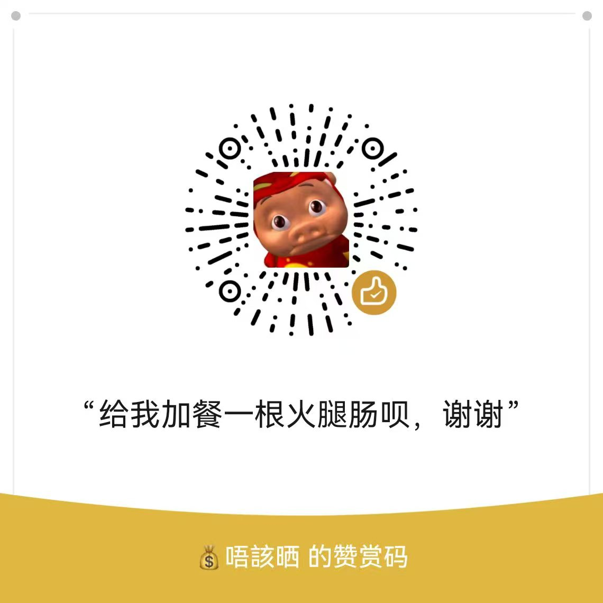

# dsh-deepseek-balance-widget

English | [中文](README.md)

A multi-provider AI balance widget for the dsh web sidebar. **DeepSeek** is built in; add **MiMo (Xiaomi)** from the popover. Auto-refreshes every 30 seconds.

## Features


**Sidebar entry**
- Live Balance / Today spend / Today tokens for the current provider, auto-refresh every 30 s
- Values follow the provider selected in the popover

**Detail popover**
- Header shows the current provider: a "**Switch**" menu changes to another added provider, "**×**" removes it (with confirmation)
- "**+ Add**" button (top right): add MiMo or DeepSeek
- DeepSeek details: balance, cumulative spend, today spend, today tokens, monthly usage (monthly spend / tokens)
- MiMo details: balance, cumulative spend, today spend / today tokens, monthly usage, and a **daily usage table** (date / tokens / requests / spend)
- DeepSeek shows a peak / off-peak badge (GMT+8: weekdays 09-12 / 14-18 are peak, weekends off-peak all day)

**Usage stats**
- DeepSeek: optional `DEEPSEEK_PLATFORM_TOKEN` (just tell your AI "help me configure usage stats"); balance-only otherwise
- MiMo: balance and usage both come from the login cookie; spend is computed at official unit prices

**AI-guided setup**
- One click in the popover copies a prompt; the AI reads the local guide file and walks you through capturing and writing credentials
- MiMo supports two paths: an AI wizard (open balance page → copy prompt), or pasting the Cookie / cURL manually (Cookie auto-extracted)
- Everything stays on your machine; nothing is uploaded

**Version & updates**
- The footer shows the current version; when a newer one exists it reads `vX → vY 更新` with one-click auto-update
- On update failure an error panel shows the details (copyable) and points you to GitHub for a manual install
- UI follows dsh's language setting (中文 / EN)

## Install

Requires: dsh installed (with `dsh web` working).

```bash
dsh plugin --profile web add dsh-deepseek-balance-widget@2.4.2
```

Installed from npm and auto-registered by dsh. **Restart `dsh web`** and the balance button appears in the sidebar.

> **Always pin the version `@2.4.2`** (the current latest stable). Do not use `@latest` — local pnpm/npm cache or a mirror registry can resolve it to an outdated release. When a newer version is released, bump the number here.

Or just tell your AI:

> Install the dsh-deepseek-balance-widget plugin for me via npm: run `dsh plugin --profile web add dsh-deepseek-balance-widget@2.4.2`.

## Configuration

On first use the plugin creates a DeepSeek entry and reads your local `DEEPSEEK_API_KEY`.

To add MiMo, open the popover, click "+ Add", then "AI 帮我配置", and send the copied prompt to your AI. Or just tell your AI:

> Configure dsh-deepseek-balance-widget for me.

The AI takes care of everything: asks for your API key / guides you through getting the platform cookie → writes the local config → reminds you to **restart `dsh web`**.

| Provider | Credential | Notes |
| --- | --- | --- |
| DeepSeek | `DEEPSEEK_API_KEY` | Required, balance |
| DeepSeek usage | `DEEPSEEK_PLATFORM_TOKEN` | Optional, cumulative / monthly / today stats |
| MiMo (Xiaomi) | Login cookie | Guided by your AI |

Credentials are stored locally in `~/.dsh/ai-balances.json`; nothing is shipped with the plugin and nothing is uploaded.

## Update

Upgrade to the latest stable release on npm regardless of which older version you currently have.

### Method 1: One-click from the popover (recommended for installed users)

1. Open the balance popover; the footer shows the version. When a newer one exists it reads `vX → vY 更新` (where `vY` is the highest semver version on npm).
2. Click "**更新**" (Update). The plugin pulls and installs the highest semver version from npm automatically.
3. After install you **must fully restart `dsh web`** (stop the `dsh web` process / quit the desktop app and reopen — **refreshing the browser tab is not enough**) for the new version to load.

> The popover's "Update" skips the `latest` tag and installs the highest semver version on npm, so it still reaches latest even if someone lowers the `latest` tag.

### Method 2: Force update from the command line (most reliable if stuck)

```bash
dsh plugin --profile web add dsh-deepseek-balance-widget@2.4.2
```

**Pinning `@2.4.2`** bypasses local cache / mirror desync / a stale `latest` resolution in one step. Then **fully restart `dsh web`**.

### Method 3: Manual update (fallback when the command-line update fails)

```bash
cd ~/.dsh/profiles/web
npm install dsh-deepseek-balance-widget@2.4.2   # use `pnpm add` if a pnpm-lock.yaml exists in this dir
# verify the on-disk version actually changed
cat node_modules/dsh-deepseek-balance-widget/package.json | grep '"version"'
```

Once it prints `2.4.2`, **fully restart `dsh web`**.

> If the popover / command-line update keeps failing (version never changes), an agent host (e.g. WorkBuddy) is likely injecting a file-deletion guard via `NODE_OPTIONS`, which makes pnpm/npm abort during updates. Run the command in a **plain terminal** (not through the agent), or unset `NODE_OPTIONS` first (PowerShell: `set NODE_OPTIONS=`) and retry.

## Uninstall

```bash
dsh plugin --profile web rm dsh-deepseek-balance-widget
```

Or just tell your AI:

> Uninstall the dsh-deepseek-balance-widget plugin for me via npm.

## Contact

Questions or suggestions? Feel free to reach out:

- Email: crazy_l118@icloud.com

## Sponsor

If this plugin helped you, consider buying me a ham sausage for dinner 🍗



## License

[MIT](LICENSE)
